# 📜 سجل التحديثات والتطوير الشامل لمنصة NGOHUB (UPDATE.md)

> **توثيق تاريخي وهندسي شامل لكافة التحسينات، الهيكلة المعمارية، الميزات البرمجية، وقواعد البيانات المضافة لمنصة NGOHUB.**

---

## 🌟 ملخص الإصدارات والمراحل التنموية (Changelog Overview)

| الإصدار | التاريخ | أبرز معالم التحديث |
| :--- | :--- | :--- |
| **v1.0 - v4.0** | مرحلة التأسيس | إطلاق المفهوم الأولي للمنصة، ربط خدمات التحول الرقمي، وتصميم الهيكل الأساسي. |
| **v5.0 - v6.0** | ثورة المنح الحقيقية | بناء سكريبت جلب 66+ منحة وفرصة دولية حقيقية، إضافة فلاتر البحث المتقدمة، وبناء لوحة تحكم CMS. |
| **v7.0** | معالجة الروابط وUNV | تدقيق 100% من الروابط ومنع أخطاء 404، إضافة برامج تطوع الأمم المتحدة (UNV)، وبناء حاسبة الجاهزية الأولية. |
| **v8.0** | التركيز على الجمعيات | توجيه الهيرو والرسالة كاملة لخدمة الجمعيات، تحديث الشركاء الحقيقيين، وتطوير التقرير التشخيصي المنبثق. |
| **v8.5** | إعادة الهيكلة المستقلة | تخصيص صفحة مستقلة للشركاء وسابقة الأعمال، ونقل لوحة تحكم الإدارة (CMS) إلى الفوتر. |
| **v9.0 (النسخة الحالية)** | التزامن السحابي التام | ربط واختبار Google Sheets Webhook الحي المباشر لتسجيل كافة الاستمارات في جدول سحابي موحد. |

---

## 🗺️ المخطط المعماري الحديث والمنظم للمنظومة (Architecture Flowchart Map)

> يمكنك فتح المخطط الفيكتوري التفاعلي عالي الدقة مباشرة عبر الملف: [`architecture_diagram.svg`](file:///c:/Users/DIAA/.gemini/antigravity/scratch/NGOhub/architecture_diagram.svg)

```mermaid
flowchart TD
    %% Global Styling
    classDef main fill:#2F6E3A,stroke:#1E4B27,stroke-width:2px,color:#fff,font-weight:bold;
    classDef router fill:#334155,stroke:#475569,stroke-width:2px,color:#fff;
    classDef page fill:#1E293B,stroke:#64748B,stroke-width:1.5px,color:#F8FAFC;
    classDef sub fill:#0F172A,stroke:#334155,stroke-width:1px,color:#CBD5E1;
    classDef action fill:#7C3AED,stroke:#5B21B6,stroke-width:2px,color:#fff,font-weight:bold;
    classDef cloud fill:#0D9488,stroke:#115E59,stroke-width:2px,color:#fff,font-weight:bold;

    %% Level 1: Visitor
    User["👥 زائر المنصة (جمعيات أهلية / مؤسسات / كوادر شبابية)"]:::main

    %% Level 2: Header Router
    User --> HeaderNav["🌐 شريط التنقل العلوي والموجه السريع (SPA Router)"]:::router

    %% Level 3: Main Sections
    HeaderNav --> SecHome["🏠 1. الصفحة الرئيسية"]:::page
    HeaderNav --> SecServices["📦 2. دليل الخدمات (8)"]:::page
    HeaderNav --> SecGrants["🌍 3. بوابة المنح (66+)"]:::page
    HeaderNav --> SecPartners["🤝 4. الشركاء وسابقة العمل"]:::page
    HeaderNav --> SecAbout["ℹ️ 5. عن المنصة والرسالة"]:::page

    %% Details of SecHome
    SecHome --> SubHero["• الهيرو والبحث الفوري المباشر"]:::sub
    SecHome --> SubPillars["• محاور التمكين الأربعة للجمعيات"]:::sub
    SecHome --> SubCalc["📊 حاسبة الجاهزية (6 معايير)"]:::action
    SubCalc --> ModalReport["📋 نافذة التقرير التشخيصي المنبثق<br/>(نقاط القوة / نقاط الضعف / خطة العمل)"]:::action

    %% Details of SecServices
    SecServices --> SubPaidSrv["🏷️ خدمات مدفوعة (استضافة ونطاق تقني)"]:::sub
    SecServices --> SubFreeSrv["🎁 مبادرات واستشارات مجانية"]:::sub
    SecServices --> FormModal["📝 نافذة طلب الخدمة والدعم"]:::action

    %% Details of SecGrants
    SecGrants --> SubGrantsNGO["• منح الجمعيات والمؤسسات"]:::sub
    SecGrants --> SubGrantsProj["• منح المشروعات والابتكار"]:::sub
    SecGrants --> SubGrantsYouth["• منح الشباب وريادة الأعمال"]:::sub
    SecGrants --> SubGrantsUNV["• فرص تطوع الأمم المتحدة (UNV)"]:::sub
    SecGrants --> SubExport["• تصدير البيانات (CSV / JSON)"]:::sub

    %% Details of SecPartners
    SecPartners --> SubPartnersGrid["• شبكة الـ 12 جهة وجمعية شريكة معتمدة"]:::sub
    SecPartners --> SubLogosStrip["• شريط العلامات واللوجوهات الرسمية"]:::sub

    %% Cloud Sync Engine
    FormModal --> Webhook["⚡ محرك Google Sheets Webhook المباشر"]:::cloud
    Webhook --> GoogleSheet[("📊 جدول Google Sheets السحابي الموحد")]:::cloud

    %% Footer & CMS
    SecHome & SecServices & SecGrants & SecPartners & SecAbout --> SiteFooter["🔻 الفوتر العام والتواصل"]:::router
    SiteFooter --> FooterWA["💬 تواصل واتساب فوري: 201026847508+"]:::action
    SiteFooter --> FooterCMS["🔐 دخول لوحة تحكم الإدارة (Admin CMS)"]:::action

    %% Admin Submodules
    FooterCMS --> CMSStats["• نظرة عامة وإحصائيات المنظومة"]:::sub
    FooterCMS --> CMSGrants["• إدارة المنح والفرص (إضافة/حذف)"]:::sub
    FooterCMS --> CMSServices["• إدارة حالة وتسعير الخدمات"]:::sub
    FooterCMS --> CMSInbox["• صندوق طلبات واستمارات الجمعيات"]:::sub
    FooterCMS --> CMSWebhookConfig["• إعدادات واختبار Google Sheets Webhook"]:::sub
    FooterCMS --> CMSBackup["• تصدير واسترجاع النسخ الاحتياطية (JSON)"]:::sub
```



---

## 🚀 تفاصيل التحديثات الجذرية المنجزة:

### 1. 🏛️ التركيز الكامل على خدمة وتمكين الجمعيات الأهلية (NGO Pivot):
- إعادة صياغة رسالة المنصة في الهيرو: **"المنصة المتكاملة للتحول الرقمي والتمكين المؤسسي للجمعيات الأهلية والمجتمعية"**.
- التركيز على 4 محاور تمكين رئيسية:
  1. *تصميم وتطوير المواقع والمنصات الرسمية (.org / .com)*.
  2. *التحول الرقمي وأتمتة سجلات وقواعد بيانات المستفيدين سحابياً*.
  3. *حوكمة وإدارة برامج المتطوعين وتوثيق الساعات*.
  4. *صياغة مقترحات المشروعات والتأهيل للمنح والشراكات*.
- إزالة الشارات والعبارات التي لا تخص الجمعيات لجعل الواجهة مريحة ومباشرة.

---

### 2. 🌍 قاعدة بيانات الـ 66+ منحة وفرصة دولية حقيقية 100% (Zero 404s):
- **بناء سكريبت التوليد الآلي الموثق** [`fetch_real_grants_opportunities.py`](file:///c:/Users/DIAA/.gemini/antigravity/scratch/NGOhub/fetch_real_grants_opportunities.py) لتوليد قاعدة البيانات [`grants_data.js`](file:///c:/Users/DIAA/.gemini/antigravity/scratch/NGOhub/grants_data.js).
- تضمين برامج تطوع الأمم المتحدة الرسمية بروابط تقديم حية:
  - منصة متطوعي الأمم المتحدة عبر الإنترنت: [`https://app.unv.org/`](https://app.unv.org/)
  - برنامج متطوعي الأمم المتحدة من الشباب: [`https://www.unv.org/become-volunteer/volunteer-your-country/youth-volunteers`](https://www.unv.org/become-volunteer/volunteer-your-country/youth-volunteers)
  - متطوعو الأمم المتحدة الدوليون في الخارج: [`https://www.unv.org/become-volunteer/volunteer-abroad`](https://www.unv.org/become-volunteer/volunteer-abroad)
  - متطوعو الأمم المتحدة الوطنيون: [`https://www.unv.org/become-volunteer/volunteer-your-country`](https://www.unv.org/become-volunteer/volunteer-your-country)
- كبرى المؤسسات المانحة: Global Innovation Fund, Ford Foundation, Skoll Foundation, D-Prize, MIT Solve, Climate Breakthrough, SGP/GEF/UNDP, WWF, Cartier Women's Initiative, Zayed Sustainability Prize.
- نظام فلاتر متقدم: (بحث لحظي، تصنيف الكيان المستهدف، القطاع التنموي، النطاق الجغرافي، تصدير CSV و JSON).

---

### 3. 📊 حاسبة الجاهزية الرقمية والتقرير التشخيصي المنبثق (Diagnostic Pop-up Report):
- توسيع الحاسبة لتشمل **6 معايير مؤسسية دقيقة**:
  1. الموقع الإلكتروني والهوية الرقمية الرسمية.
  2. قواعد بيانات وسجلات المستفيدين السحابية المشفرة.
  3. حوكمة وتوثيق ساعات برامج المتطوعين.
  4. الحوكمة والتقارير المالية والشفافية.
  5. المكون الذكي والمقترحات البيئية والتنموية.
  6. قياس الأثر المجتمعي والتقارير السنوية (M&E).
- **نافذة منبثقة تفاعلية ذكية (`#readinessReportModal`)** تولد تقريراً تشخيصياً فورياً يتضمن:
  - نسبة الجاهزية ومستوى الجمعية (تأسيسي / واعد / مؤهل للشراكات الدولية).
  - **قائمة نقاط القوة الحالية (Identified Strengths)**.
  - **قائمة الفجوات التشغيلية ونقاط الضعف (Gaps & Weaknesses)**.
  - **خطة الخطوات التالية الموصى بها (Actionable Roadmap)**.
  - زر مباشر لطلب الدعم المؤسسي والتطوير.

---

### 4. 🤝 صفحة الشركاء وسابقة التعاون المستقلة واللوجوهات المعتمدة:
- نقل قسم الشركاء وسابقة التعاون من الصفحة الرئيسية إلى صفحة مخصصة مستقلة (`#section-partners`) مع إضافة زر الانتقال إليها بالهيدر والقائمة الجانبية.
- ربط اللوجوهات الحقيقية من المجلد `محتوي/لوجوهات`:
  1. **جمعية الإسراء** (`محتوي/لوجوهات/لوجو جمعية الاسراء.jpg` - الشريك المجتمعي للمبادرة).
  2. **جمعية بنيان للتدخل المبكر** (`محتوي/لوجوهات/بنيان للتدخل المبكر.jpg` - شريك تأهيل ذوي الهمم).
  3. **محافظة / وزارة البحيرة** (`محتوي/لوجوهات/لوجو وزارة البحيرة.png` - شريك التنسيق المؤسسي المحلي).
  4. **مركز التدريب البيئي** (`محتوي/لوجوهات/لوجو مركز التدريب البيئى.png` - شريك التدريب وبناء القدرات).
  5. **حاضنة الأعمال البيئية للمرأة المصرية** (`محتوي/لوجوهات/لوجو حاضنة الاعمال البيئية للمراة المصرية.png` - شريك تمكين المرأة الخضراء).
  6. **PR CUBE** (`محتوي/لوجوهات/لوجو pr cube.png` - الشريك السعودي للمبادرة).
  7. **Green Cap Team (GCT)** (`محتوي/لوجوهات/لوجو  gct.png`).
  8. **مشروع أزولا مصر** (`محتوي/لوجوهات/ازولا مصر.png`).
  9. **PROTIC Solutions** (`محتوي/لوجوهات/بروتيك.png`).
  10. **جمعية الرحمة الخيرية** (`محتوي/لوجوهات/لوجو جمعية الرحمة.jpg`).
  11. **نقابة المهندسين بالبحيرة** (`محتوي/لوجوهات/لوجو نقابة المهندسين بالبحيرة.png`).
  12. **وزارة التضامن الاجتماعي** (`محتوي/لوجوهات/وزارة التضامن.jpg`).
  13. **UNDP / GEF / SGP والمكتب العربي للشباب والبيئة**.

---

### 5. 📑 التزامن السحابي الحي عبر Google Sheets Webhook:
- إنشاء كود Google Apps Script المتكامل في ملف [`google_apps_script_webhook.js`](file:///c:/Users/DIAA/.gemini/antigravity/scratch/NGOhub/google_apps_script_webhook.js).
- ربط وتفعيل الرابط المباشر للويب هوك:
  `https://script.google.com/macros/s/AKfycbynU9c1SDeXkdEWMGQUJzsc9ERcYfPnhQ9yhorcEvgIZ2byHLtNRM1lHlLA3z-m7iYV/exec`
- وصول وتسجيل كافة طلبات الجمعيات لحظياً داخل جدول Google Sheets واحد منسق تلقائياً مع حفظ نسخة محلية في لوحة الإدارة.

---

### 6. 🔐 إعادة هيكلة الهيدر ونقل لوحة التحكم للفوتر:
- إزالة زر لوحة الإدارة من الهيدر الرئيسي ليبقى مخصصاً للجمهور والمستفيدين.
- وضع رابط دخول لوحة تحكم الإدارة (Admin CMS) داخل الفوتر بأيقونة القفل: `🔒 [دخول لوحة تحكم الإدارة (CMS)]`.
- بيانات الدخول: Username: `admin` | Password: `ngohub2026`.

---

### 7. 🏷️ توضيح سياسة التسعير والموارد التقنية:
- تنقيح كافة العبارات لتأكيد أن المبالغ المدفوعة تخص فقط **الموارد التقنية الخارجية** (مثل: حجز النطاق الرسمي `.org`، وحسابات الاستضافة السحابية والسيرفرات السنوية) بسعر التكلفة المباشر لمزود الخدمة أو من خلال سيرفرات الجمعية الخاصة، مع توفير كافة الاستشارات والتوجيه مجاناً كمبادرة تنموية.

---

## 📁 خريطة ملفات المشروع النظيفة (Project File Structure):

```text
NGOhub/
├── index.html                      # واجهة المنصة الشاملة، المودالات، والصفحات (Single Page App)
├── styles.css                      # ملف التنسيقات الرئيسي (Dark/Light Mode، Responsive UI)
├── app.js                          # محرك المنصة (SPA Router، الحاسبة التشخيصية، ربط Webhook، لوحة CMS)
├── grants_data.js                  # قاعدة بيانات الـ 66+ منحة وفرصة عالمية المعتمدة
├── fetch_real_grants_opportunities.py # سكريبت بايثون لجلب وتحديث الفرص الحقيقية
├── google_apps_script_webhook.js   # كود Google Apps Script الجاهز للنشر على Google Sheets
├── architecture_diagram.svg        # المخطط المعماري الحديث والتفاعلي للمنظومة
├── README.md                       # الدليل التوثيقي الرئيسي للمشروع
├── UPDATE.md                       # سجل التحديثات والتغييرات التفصيلي والمخطط المعماري
├── .gitignore                      # ملف استبعاد الملفات المؤقتة واللوجز
└── محتوي/
    └── لوجوهات/                   # المجلد الحاوي لكافة لوجوهات الشركاء والمشروعات الرسمية
```

---

## 🔒 بروتوكول الأمان والسلامة (GitHub Rule):
- تم الالتزام الصارم بقواعد الأمان ولم يتم إجراء أي رفع (Push) على مستودع GitHub الخارجي عن بُعد تماشياً مع قاعدة الأمان المعتمدة.
