```mermaid
flowchart TD
    %% Global Styling
    classDef main fill:#2F6E3A,stroke:#1E4B27,stroke-width:2px,color:#fff,font-weight:bold;
    classDef router fill:#334155,stroke:#475569,stroke-width:2px,color:#fff;
    classDef page fill:#1E293B,stroke:#64748B,stroke-width:1.5px,color:#F8FAFC;
    classDef sub fill:#0F172A,stroke:#334155,stroke-width:1px,color:#CBD5E1;
    classDef action fill:#7C3AED,stroke:#5B21B6,stroke-width:2px,color:#fff,font-weight:bold;
    classDef cloud fill:#0D9488,stroke:#115E59,stroke-width:2px,color:#fff,font-weight:bold;

    %% Level 1: Visitor
    User["👥 زائر المنصة (جمعيات أهلية / مؤسسات / كوادر شبابية)"]:::main

    %% Level 2: Header Router
    User --> HeaderNav["🌐 شريط التنقل العلوي والموجه السريع (SPA Router)"]:::router

    %% Level 3: Main Sections
    HeaderNav --> SecHome["🏠 1. الصفحة الرئيسية"]:::page
    HeaderNav --> SecServices["📦 2. دليل الخدمات (8)"]:::page
    HeaderNav --> SecGrants["🌍 3. بوابة المنح (66+)"]:::page
    HeaderNav --> SecPartners["🤝 4. الشركاء وسابقة العمل"]:::page
    HeaderNav --> SecAbout["ℹ️ 5. عن المنصة والرسالة"]:::page

    %% Details of SecHome
    SecHome --> SubHero["• الهيرو والبحث الفوري المباشر"]:::sub
    SecHome --> SubPillars["• محاور التمكين الأربعة للجمعيات"]:::sub
    SecHome --> SubCalc["📊 حاسبة الجاهزية (6 معايير)"]:::action
    SubCalc --> ModalReport["📋 نافذة التقرير التشخيصي المنبثق<br/>(نقاط القوة / نقاط الضعف / خطة العمل)"]:::action

    %% Details of SecServices
    SecServices --> SubPaidSrv["🏷️ خدمات مدفوعة (استضافة ونطاق تقني)"]:::sub
    SecServices --> SubFreeSrv["🎁 مبادرات واستشارات مجانية"]:::sub
    SecServices --> FormModal["📝 نافذة طلب الخدمة والدعم"]:::action

    %% Details of SecGrants
    SecGrants --> SubGrantsNGO["• منح الجمعيات والمؤسسات"]:::sub
    SecGrants --> SubGrantsProj["• منح المشروعات والابتكار"]:::sub
    SecGrants --> SubGrantsYouth["• منح الشباب وريادة الأعمال"]:::sub
    SecGrants --> SubGrantsUNV["• فرص تطوع الأمم المتحدة (UNV)"]:::sub
    SecGrants --> SubExport["• تصدير البيانات (CSV / JSON)"]:::sub

    %% Details of SecPartners
    SecPartners --> SubPartnersGrid["• شبكة الـ 12 جهة وجمعية شريكة معتمدة"]:::sub
    SecPartners --> SubLogosStrip["• شريط العلامات واللوجوهات الرسمية"]:::sub

    %% Cloud Sync Engine
    FormModal --> Webhook["⚡ محرك Google Sheets Webhook المباشر"]:::cloud
    Webhook --> GoogleSheet[("📊 جدول Google Sheets السحابي الموحد")]:::cloud

    %% Footer & CMS
    SecHome & SecServices & SecGrants & SecPartners & SecAbout --> SiteFooter["🔻 الفوتر العام والتواصل"]:::router
    SiteFooter --> FooterWA["💬 تواصل واتساب فوري: 201026847508+"]:::action
    SiteFooter --> FooterCMS["🔐 دخول لوحة تحكم الإدارة (Admin CMS)"]:::action

    %% Admin Submodules
    FooterCMS --> CMSStats["• نظرة عامة وإحصائيات المنظومة"]:::sub
    FooterCMS --> CMSGrants["• إدارة المنح والفرص (إضافة/حذف)"]:::sub
    FooterCMS --> CMSServices["• إدارة حالة وتسعير الخدمات"]:::sub
    FooterCMS --> CMSInbox["• صندوق طلبات واستمارات الجمعيات"]:::sub
    FooterCMS --> CMSWebhookConfig["• إعدادات واختبار Google Sheets Webhook"]:::sub
    FooterCMS --> CMSBackup["• تصدير واسترجاع النسخ الاحتياطية (JSON)"]:::sub
```

# 📜 سجل التحديثات والتطوير الشامل لمنصة NGOHUB (UPDATE.md)

> **توثيق تاريخي وهندسي شامل لكافة التحسينات، الهيكلة المعمارية، الميزات البرمجية، وقواعد البيانات المضافة لمنصة NGOHUB.**

---

## 📁 الهيكل المعماري للمستودع (Repository Structure)

```text
ngohub/
├── 📁 assets/                    # الأصول الرقمية والتصميم
│   ├── 📁 css/                   # ملفات التنسيق والتجاوب (styles.css)
│   ├── 📁 images/                # الشعارات الرسمية والصور التوثيقية والأنشطة
│   └── 📁 js/                    # الأكواد المجمعة وموجه الصفحات (app.js, grants_data.js)
├── 📁 docs/                      # الوثائق المرجعية ومواصفات المشروع
│   ├── 📁 guides/                # الأدلة الرسمية وتكامل Webhook (google_apps_script_webhook.js)
│   └── 📁 specs/                 # وثيقة المشروع والمواصفات المعتمدة (Master Prompt & Architecture SVG)
├── 📁 tests/                     # حزم الاختبارات وسكريبت المزامنة (fetch_real_grants_opportunities.py, test_webhook.py)
├── 📁 .github/workflows/         # مسار النشر السحابي التلقائي (static.yml)
├── 📄 index.html                 # الملف الرئيسي للمنصة SPA
├── 📄 README.md                  # الدليل التعريفي الشامل للمبادرة
├── 📄 UPDATE.md                  # السجل المركزي الموحد لكافة التحديثات (هذا الملف)
├── 📄 .nojekyll                  # ملف ضبط وتوافق خوادم GitHub Pages
└── 📄 .gitignore                 # ملف استبعاد الملفات المؤقتة
```

---

## 🌟 ملخص الإصدارات والمراحل التنموية (Changelog Overview)

| الإصدار | التاريخ | أبرز معالم التحديث |
| :--- | :--- | :--- |
| **v1.0 - v4.0** | مرحلة التأسيس | إطلاق المفهوم الأولي للمنصة، ربط خدمات التحول الرقمي، وتصميم الهيكل الأساسي. |
| **v5.0 - v6.0** | ثورة المنح الحقيقية | بناء سكريبت جلب 66+ منحة وفرصة دولية حقيقية، إضافة فلاتر البحث المتقدمة، وبناء لوحة تحكم CMS. |
| **v7.0** | معالجة الروابط وUNV | تدقيق 100% من الروابط ومنع أخطاء 404، إضافة برامج تطوع الأمم المتحدة (UNV)، وبناء حاسبة الجاهزية الأولية. |
| **v8.0** | التركيز على الجمعيات | توجيه الهيرو والرسالة كاملة لخدمة الجمعيات، تحديث الشركاء الحقيقيين، وتطوير التقرير التشخيصي المنبثق. |
| **v8.5** | إعادة الهيكلة المستقلة | تخصيص صفحة مستقلة للشركاء وسابقة الأعمال، ونقل لوحة تحكم الإدارة (CMS) إلى الفوتر. |
| **v9.0 (النسخة الحالية)** | التزامن السحابي التام | ربط واختبار Google Sheets Webhook الحي المباشر لتسجيل كافة الاستمارات في جدول سحابي موحد، وهيكلة المستودع المعيارية. |

---

## 🗺️ المخطط المعماري الحديث للمنظومة (Architecture Flowchart Map)



---

## 🚀 تفاصيل التحديثات الجذرية المنجزة:

### 1. 🏛️ التركيز الكامل على خدمة وتمكين الجمعيات الأهلية (NGO Pivot):
- إعادة صياغة رسالة المنصة في الهيرو: **"المنصة المتكاملة للتحول الرقمي والتمكين المؤسسي للجمعيات الأهلية والمجتمعية"**.
- التركيز على 4 محاور تمكين رئيسية:
  1. *تصميم وتطوير المواقع والمنصات الرسمية (.org / .com)*.
  2. *التحول الرقمي وأتمتة البيانات والعمليات المؤسسية سحابياً*.
  3. *تنظيم وإدارة برامج المتطوعين وتوثيق الساعات*.
  4. *صياغة مقترحات المشروعات والتأهيل للمنح والشراكات*.

---

### 2. 🌍 قاعدة بيانات الـ 66+ منحة وفرصة دولية حقيقية 100% (Zero 404s):
- **بناء سكريبت التوليد الآلي الموثق** [`tests/fetch_real_grants_opportunities.py`](file:///c:/Users/DIAA/.gemini/antigravity/scratch/NGOhub/tests/fetch_real_grants_opportunities.py) لتوليد قاعدة البيانات [`assets/js/grants_data.js`](file:///c:/Users/DIAA/.gemini/antigravity/scratch/NGOhub/assets/js/grants_data.js).
- تضمين برامج تطوع الأمم المتحدة الرسمية بروابط تقديم حية:
  - منصة متطوعي الأمم المتحدة عبر الإنترنت: [`https://app.unv.org/`](https://app.unv.org/)
  - برنامج متطوعي الأمم المتحدة من الشباب: [`https://www.unv.org/become-volunteer/volunteer-your-country/youth-volunteers`](https://www.unv.org/become-volunteer/volunteer-your-country/youth-volunteers)
  - متطوعو الأمم المتحدة الدوليون في الخارج: [`https://www.unv.org/become-volunteer/volunteer-abroad`](https://www.unv.org/become-volunteer/volunteer-abroad)
  - متطوعو الأمم المتحدة الوطنيون: [`https://www.unv.org/become-volunteer/volunteer-your-country`](https://www.unv.org/become-volunteer/volunteer-your-country)
- كبرى المؤسسات المانحة: Global Innovation Fund, Ford Foundation, Skoll Foundation, D-Prize, MIT Solve, Climate Breakthrough, SGP/GEF/UNDP, WWF, Cartier Women's Initiative, Zayed Sustainability Prize.

---

### 3. 📊 حاسبة الجاهزية الرقمية والتقرير التشخيصي المنبثق (Diagnostic Pop-up Report):
- توسيع الحاسبة لتشمل **6 معايير مؤسسية دقيقة**:
  1. الموقع الإلكتروني والهوية الرقمية الرسمية.
  2. قواعد البيانات السحابية المشفرة وإدارة المشاريع.
  3. تنظيم وتوثيق ساعات برامج المتطوعين.
  4. الشفافية والتقارير المالية السنوية.
  5. المكون الذكي والمقترحات البيئية والتنموية.
  6. قياس الأثر المجتمعي والتقارير السنوية (M&E).
- **نافذة منبثقة تفاعلية ذكية (`#readinessReportModal`)** تولد تقريراً تشخيصياً فورياً يتضمن:
  - نسبة الجاهزية ومستوى الجمعية.
  - نقاط القوة، الفجوات التشغيلية، وخطة العمل التالية.

---

### 4. 🤝 صفحة الشركاء وسابقة التعاون المستقلة واللوجوهات المعتمدة:
- تخصيص صفحة مستقلة (`#section-partners`) تضم شبكة الـ 12 جهة مع لوجوهاتها المعتمدة:
  1. **جمعية الإسراء** (الشريك المجتمعي للمبادرة).
  2. **جمعية بنيان للتدخل المبكر** (شريك تأهيل ذوي الهمم).
  3. **محافظة / وزارة البحيرة** (شريك التنسيق المؤسسي المحلي).
  4. **مركز التدريب البيئي** (شريك التدريب وبناء القدرات).
  5. **حاضنة الأعمال البيئية للمرأة المصرية** (شريك تمكين المرأة الخضراء).
  6. **PR CUBE** (الشريك السعودي للمبادرة).
  7. **Green Cap Team (GCT)**، **مشروع أزولا مصر**، **PROTIC Solutions**، **جمعية الرحمة**، **نقابة المهندسين بالبحيرة**، و **وزارة التضامن الاجتماعي**.

---

### 5. 📑 التزامن السحابي الحي عبر Google Sheets Webhook:
- إنشاء كود Google Apps Script المتكامل في ملف [`docs/guides/google_apps_script_webhook.js`](file:///c:/Users/DIAA/.gemini/antigravity/scratch/NGOhub/docs/guides/google_apps_script_webhook.js).
- ربط وتفعيل الرابط المباشر للويب هوك:
  `https://script.google.com/macros/s/AKfycbynU9c1SDeXkdEWMGQUJzsc9ERcYfPnhQ9yhorcEvgIZ2byHLtNRM1lHlLA3z-m7iYV/exec`
- وصول وتسجيل كافة طلبات الجمعيات لحظياً داخل جدول Google Sheets واحد منسق تلقائياً مع حفظ نسخة محلية في لوحة الإدارة.

---

## 🔒 بروتوكول الأمان والسلامة (GitHub Rule):
- تم الالتزام الصارم بقواعد الأمان ولم يتم إجراء أي رفع (Push) على مستودع GitHub الخارجي عن بُعد تماشياً مع قاعدة الأمان المعتمدة.
